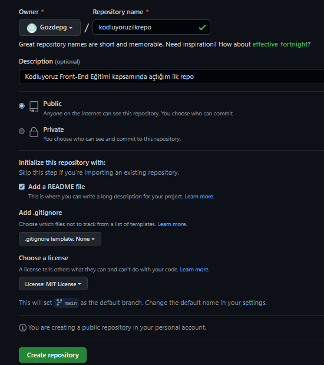

# kodluyoruzilkrepo
Kodluyoruz Front-End Eğitimi kapsamında açtığım ilk repo
# kodluyoruzilkrepo
Bu repo [Kodluyoruz](https://www.kodluyoruz.org) Front-End Eğitiminde oluşturduğumuz ilk repo. İçerisinde bir adet README dosyası, bir adet de index.html barındırıyor.

 

## Installation
Öncelikle projeyi clonelayın. (Buraya sizin reponuzdan aldığınız link gelecek)
<pre><code> git clone https://github.com/Gozdepg/kodluyoruzilkrepo.git </code></pre>

## Usage
Projeyi cloneladıktan sonra Visual Studio Code programında açınız.

Linux için:
<pre><code> cd kodluyoruzilkrepo 
 code . </code></pre>

## Contributing
Pull requestler kabul edilir. Büyük değişiklikler için, lütfen önce neyi değiştirmek istediğinizi tartışmak için bir konu açınız.

## License
[MIT](https://choosealicense.com/licenses/mit/)
